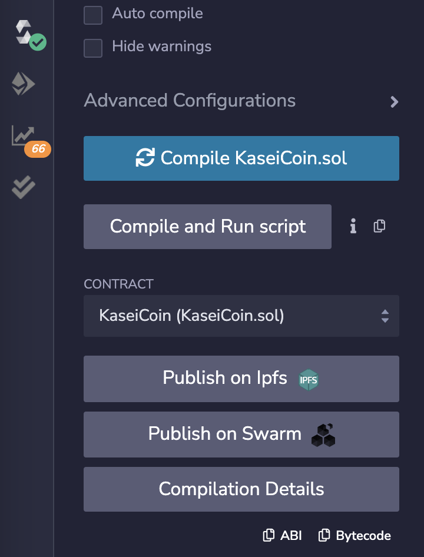
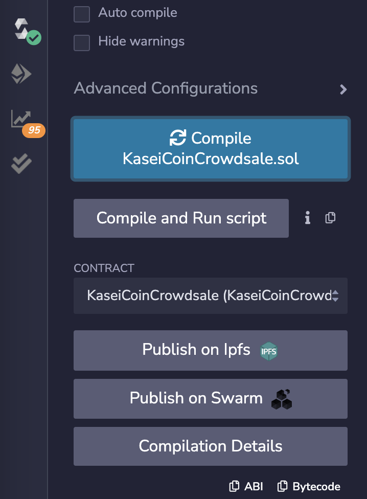
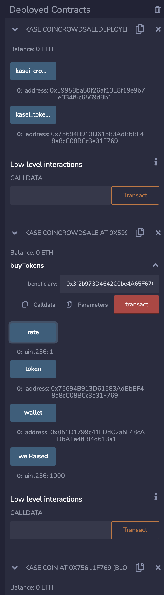

# Kasei Coin

ERC-20 token, crowdsale, and deployer contracts to crowdsale a new token called KaseiCoin (KSC) and allow users to purchase newly minted tokens.

---

## Technologies

This project leverages Solidity and was created/tested using Remix IDE and Metamask via injection. This project also utilizes the follwoing libraries:

* [OpenZeppelin-Contracts](https://github.com/OpenZeppelin/openzeppelin-contracts) - For Crowdsale & ERC20.

---

## Installation Guide

Remix IDE can be used in browser or downloaded as a desktop application. This smart contract was built and tested on the web version using Metamask and Ganache.

---

## Usage

To test deploy this contract using Remix IDE, navigate to the "Deploy & Run Transactions" tab after compiling and deploy using the injected provider - Metamask option or other preferred VM. The deployer contract will deploy the token and crowdsale contracts and provide addresses for them, enabling the user to purches KaseiCoin for Ethereum.
---

## Evaluation Evidence

Below are images showcasing the successful compilation of the contracts as well as the final result showcasing a transaction:

---

## Contributors

Brought to you by Majid Kouki. You can reach me at [majidkpy@gmail.com](mailto:majidkpy@gmail.com).

---

## License

